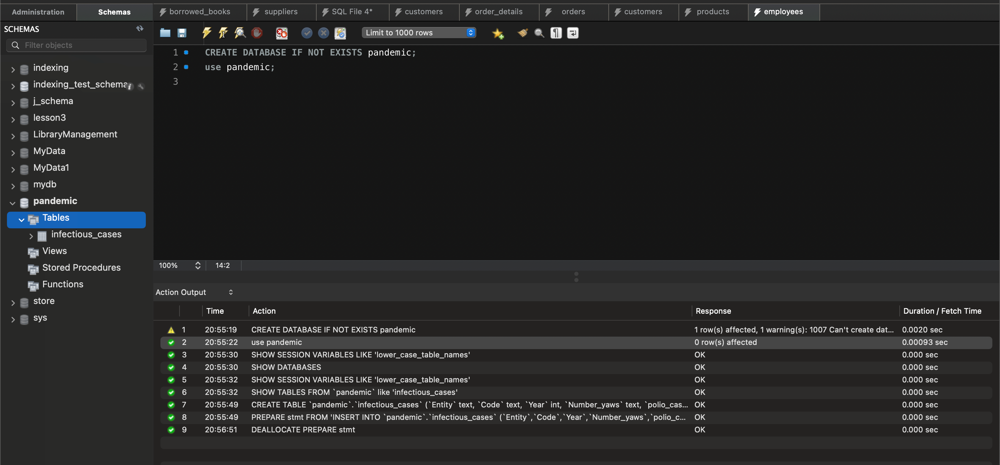
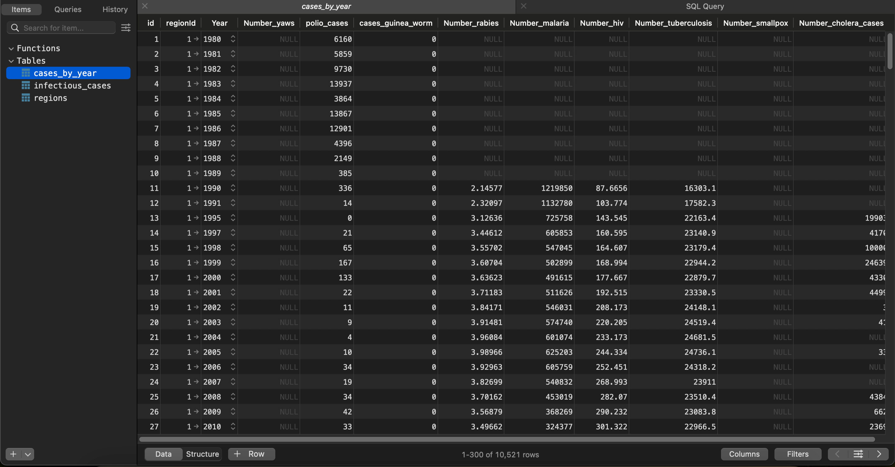
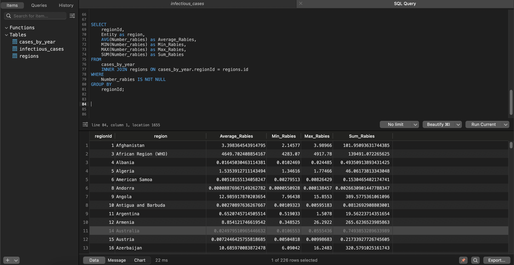
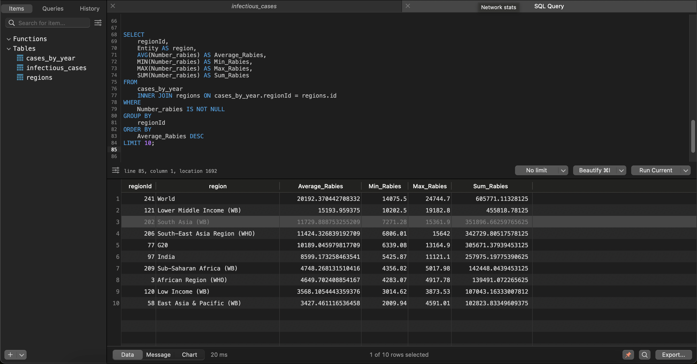
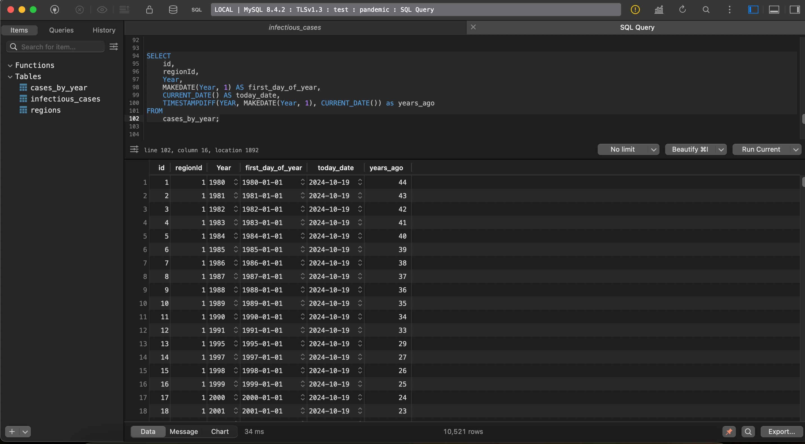
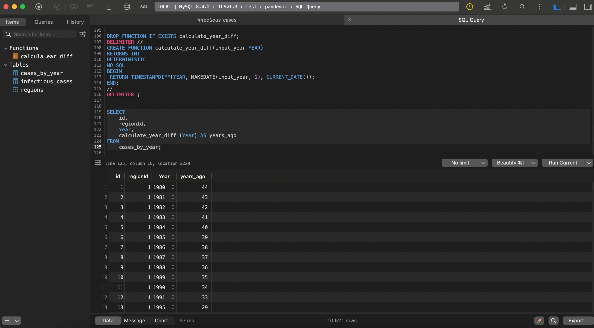

# goit-rdb-fp

## 1. Імпорт даних

За допомогою MySQL Workbench імпортували дані з файлу `infectious_cases.csv` в таблицю `infectious_cases`.


Для зручності замінив порожні значення атрибутів на `NULL`.

```sql
UPDATE
 infectious_cases
SET
 Code = NULL
WHERE
 Code = '';
```

## 2. Нормалізація

Створив таблицю `regions` для зберігання унікальних значень атрибутів `Entity` та `Code` з таблиці `infectious_cases` та наповнив її даними.

```sql
CREATE table regions (
 id INT PRIMARY KEY AUTO_INCREMENT,
 Entity VARCHAR(45), 
 Code VARCHAR(10)
);

INSERT INTO regions (Entity, Code)
SELECT
 Entity,
 Code
FROM
 infectious_cases
GROUP BY
 Entity,
 Code;

```

Створив таблицю `cases_by_year` для зберігання даних про кількість випадків захворювань на рік та наповнив її даними.

```sql
INSERT INTO cases_by_year (regionId, Year, Number_yaws, polio_cases, cases_guinea_worm, Number_rabies, Number_malaria, Number_hiv, Number_tuberculosis, Number_smallpox, Number_cholera_cases)
SELECT
 id AS regionId,
 Year,
 Number_yaws,
 polio_cases,
 cases_guinea_worm,
 Number_rabies,
 Number_malaria,
 Number_hiv,
 Number_tuberculosis,
 Number_smallpox,
 Number_cholera_cases
FROM
 regions AS r
 INNER JOIN infectious_cases AS ic ON r.Code = ic.Code
  OR r.Entity = ic.Entity;
```

Подальша нормалізація передбачає розбиття таблиці `cases_by_year` на окремі таблиці per year, але це призведе до створення близько 45 таблиць, що не є доцільним в даному випадку та призведе до монстуозних `JOIN` запитів для отримання даних.

У цьому і подальшому завданнях використовувався клієнт TablePlus.





## 3. Статистичні запити

Cереднє, мінімальне, максимальне значення та суму для атрибута Number_rabies:

```sql
SELECT
 regionId,
 Entity as region,
 AVG(Number_rabies) as Average_Rabies,
 MIN(Number_rabies) as Min_Rabies,
 MAX(Number_rabies) as Max_Rabies,
 SUM(Number_rabies) as Sum_Rabies
FROM
 cases_by_year
 INNER JOIN regions ON cases_by_year.regionId = regions.id
WHERE
 Number_rabies IS NOT NULL
GROUP BY
 regionId;
```



10 посортованих результатів за середнім значенням атрибута Number_rabies:

```sql
SELECT
 regionId,
 Entity AS region,
 AVG(Number_rabies) AS Average_Rabies,
 MIN(Number_rabies) AS Min_Rabies,
 MAX(Number_rabies) AS Max_Rabies,
 SUM(Number_rabies) AS Sum_Rabies
FROM
 cases_by_year
 INNER JOIN regions ON cases_by_year.regionId = regions.id
WHERE
 Number_rabies IS NOT NULL
GROUP BY
 regionId
ORDER BY
 Average_Rabies DESC
LIMIT 10;
```



## 4. Обчислення різниці часу

Вибираємо тільки атрибути id, regionId, Year та обчислюємо:

* атрибут, що створює дату першого січня відповідного року (*first_day_of_year*)
* атрибут, що дорівнює поточній даті (*today_date*)
* атрибут, що дорівнює різниці в роках двох вищезгаданих колонок (*years_ago*)

```sql
SELECT
 id,
 regionId,
 Year,
 MAKEDATE(Year, 1) AS first_day_of_year,
 CURRENT_DATE() AS today_date,
 TIMESTAMPDIFF(YEAR, MAKEDATE(Year, 1), CURRENT_DATE()) as years_ago
FROM
 cases_by_year;
```



## 5. Функція розрахунку кількості років

Функція `calculate_year_diff` приймає рік та повертає різницю в роках між роком з атрибуту *Year* та поточною датою.

```sql
DROP FUNCTION IF EXISTS calculate_year_diff;
DELIMITER //
CREATE FUNCTION calculate_year_diff(input_year YEAR)
RETURNS INT
DETERMINISTIC
NO SQL
BEGIN
 RETURN TIMESTAMPDIFF(YEAR, MAKEDATE(input_year, 1), CURRENT_DATE());
END;
//
DELIMITER ;
```

```sql
SELECT
 id,
 regionId,
 Year,
 calculate_year_diff (Year) AS years_ago
FROM
 cases_by_year;
```


