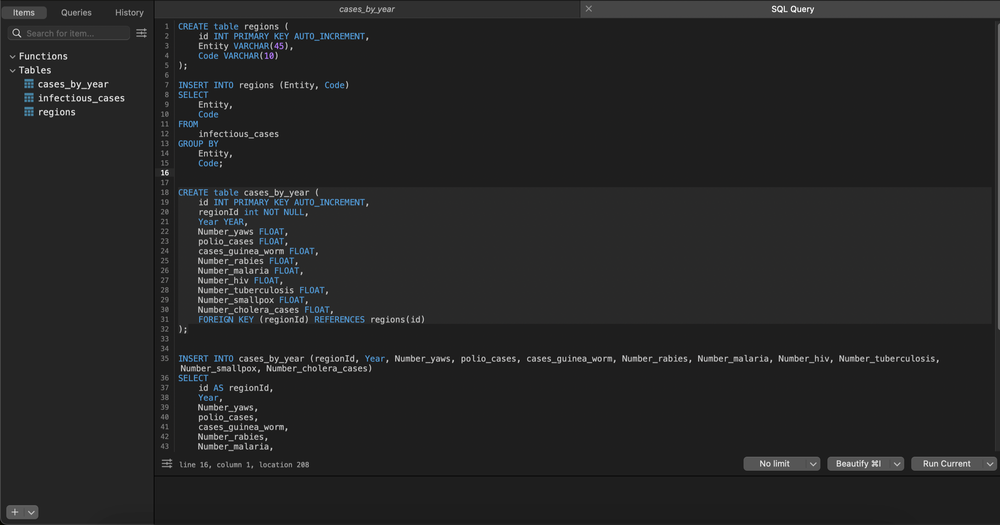

# goit-rdb-fp

## 1. Імпорт даних

За допомогою MySQL Workbench імпортували дані з файлу `infectious_cases.csv` в таблицю `infectious_cases`.


Для зручності замінив порожні значення атрибутів на `NULL`.

```sql
UPDATE
 infectious_cases
SET
 Code = NULL
WHERE
 Code = '';
```

## 2. Нормалізація

Створив таблицю `regions` для зберігання унікальних значень атрибутів `Entity` та `Code` з таблиці `infectious_cases` та наповнив її даними.

```sql
CREATE table regions (
 id INT PRIMARY KEY AUTO_INCREMENT,
 Entity VARCHAR(45), 
 Code VARCHAR(10)
);

INSERT INTO regions (Entity, Code)
SELECT
 Entity,
 Code
FROM
 infectious_cases
GROUP BY
 Entity,
 Code;

```

Створив таблицю `cases_by_year` для зберігання даних про кількість випадків захворювань на рік та наповнив її даними.

```sql
INSERT INTO cases_by_year (regionId, Year, Number_yaws, polio_cases, cases_guinea_worm, Number_rabies, Number_malaria, Number_hiv, Number_tuberculosis, Number_smallpox, Number_cholera_cases)
SELECT
 id AS regionId,
 Year,
 Number_yaws,
 polio_cases,
 cases_guinea_worm,
 Number_rabies,
 Number_malaria,
 Number_hiv,
 Number_tuberculosis,
 Number_smallpox,
 Number_cholera_cases
FROM
 regions AS r
 INNER JOIN infectious_cases AS ic ON r.Code = ic.Code
  OR r.Entity = ic.Entity;
```

Подальша нормалізація передбачає розбиття таблиці `cases_by_year` на окремі таблиці per year, але це призведе до створення близько 45 таблиць, що не є доцільним в даному випадку та призведе до монстуозних `JOIN` запитів для отримання даних.

У цьому і подільшому завданнях використовувався клієнт TablePlus.




